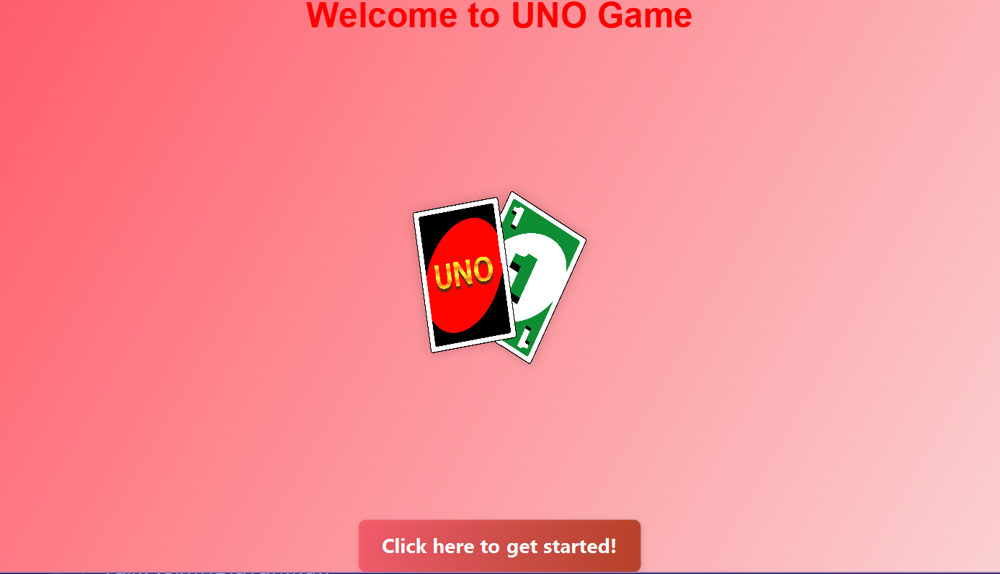

# Final Project - UNO Game
**Course Name**: MAD 200 -  Java Programming 2  
**Professor**: Câi Filiault


## Table of Contents
- [Project Overview](#project-overview)
- [Project Structure](#project-structure)
- [How to Play](#how-to-play)
- [Technologies Used](#technologies-used)
- [How to Run the Game](#how-to-run-the-game)
- [Modifications & Updates](#modifications--updates)
- [FAQ](#faq)
- [Team Members](#team-members)

---

## Project Overview

Welcome to **UNO Game** – a fun card game made with JavaFX. This was a group project where we worked on game rules, animations, and a cool design. Enjoy playing UNO with smooth moves and a lively interface!

---

## Project Structure

### **Planned Structure:**
```
src/
└── main/
└── java/
└── com.uno/
├── game/
│   ├── Card.java
│   ├── CardColor.java
│   ├── CardLoader.java
│   ├── CardType.java
│   ├── Deck.java
│   ├── GameDirection.java
│   ├── GameEventPublisher.java
│   ├── GameSession.java
│   ├── PileManager.java
│   ├── Player.java
│   ├── PlayerCardList.java
│   ├── PlayerStateManager.java
│   └── UnoCardDeck.java
├── ui/
│   ├── SinglePlayerScreen.java
│   ├── MainMenu.java
│   ├── StartScreen.java
│   ├── LoadingScreen.java
│   ├── PlayerScreen.java
│   ├── Settings.java
│   ├── CreditsScreen.java
│   └── GameScreenM.java
├── core/
│   ├── GameLauncher.java
│   ├── GameLogic.java
│   └── UnoRules.java
└── util/
├── Music.java
└── TestCardLoader.java
```

### **Final Implemented Structure:**
```
src/
└── main/
    └── java/
        ├── com.uno/
        │   └── Additional_GameLogic_Files/
        │       ├── Card.java
        │       ├── CardColor.java
        │       ├── CardLoader.java
        │       ├── CardType.java
        │       ├── GameDirection.java
        │       ├── GameEventPublisher.java
        │       ├── GameLaunch.java
        │       ├── GameSession.java
        │       ├── PileManager.java
        │       ├── Player.java
        │       ├── PlayerCardList.java
        │       ├── PlayerStateManager.java
        │       ├── SinglePlayerScreen.java
        │       └── UnoCardDeck.java
        └── (root files)/
            ├── Card.java
            ├── CardLoader.java
            ├── CreditsScreen.java
            ├── Deck.java
            ├── GameLauncher.java
            ├── GameLogic.java
            ├── GameScreenM.java
            ├── LoadingScreen.java
            ├── MainMenu.java
            ├── Music.java
            ├── Player.java
            ├── PlayerScreen.java
            ├── Settings.java
            ├── StartScreen.java
            ├── TestCardLoader.java
            └── UnoRules.java
```

---

## How to Play

1. **Start the Game**: Launch the game from the main menu.
2. **Match Cards**: Play a card that matches the color or number of the top card on the pile.
3. **Use Special Cards**: Take advantage of special cards like **Skip**, **Reverse**, and **Draw Two** to gain an edge over your opponents.
4. **Win**: Be the first player to get rid of all your cards to win the game!
5. **UNO!**: Don’t forget to shout **UNO** when you have just one card left.

---

## Technologies Used
- **Java 17+** – Core programming language
- **JavaFX** – GUI framework for building the user interface
- **IntelliJ IDEA** – IDE used for development
- **Git/GitHub** – Version control for collaborative development

---

## How to Run the Game

### Requirements
- **Java 17+**
- **JavaFX SDK**
- **IDE**: IntelliJ IDEA or any similar IDE

### Steps
1. Clone this repository:
   ```bash
   git clone "https://github.com/Kensukeken/MAD200_Final-Project-Uno-Game.git"
   ```  
2. Open the project in your IDE.
3. Set up **JavaFX libraries** if necessary.
4. Run **`GameLauncher.java`** to start the game.

---

## Screenshots and Animations

### Starter Screen
  

The **starter screen** is the first thing players see when they launch the game. It sets the tone for the game and transitions smoothly into the **main menu**. This screen welcomes players and prepares them to dive into the UNO experience.

### Loading Animation
  

As the game loads, the **loading animation** provides a dynamic and engaging way to keep players entertained while the game environment and assets are being set up. This animation ensures that players have visual feedback while they wait for the game to fully initialize.

### Main Menu
  

The **main menu** screen is the hub of the game, offering players various options such as starting a new game, adjusting game settings, and accessing the credits section. It serves as the entry point to the rest of the game, providing a seamless navigation experience.

### Game Screen
  

The **game screen** is where the action happens. Players can view their hand of cards, interact with the deck, and play their moves. This screen features a vibrant and intuitive user interface that allows players to focus on their gameplay while keeping track of key elements like the draw pile and played cards.

### Pause Screen
  

The **pause screen** appears when the game is paused, giving players a moment to take a break. It provides options to resume the game, adjust settings, or return to the main menu. This screen helps ensure that players can manage their game experience easily without losing progress.

### Settings Screen
  

The **settings screen** lets players tailor their game experience by adjusting options like sound effects, music volume, and gameplay preferences. Whether you're fine-tuning the audio or configuring other gameplay features, this screen offers flexibility to enhance the user experience.

### Credits Screen
  

The **credits screen** is a way to honor and recognize the developers and contributors who worked on the game. It showcases their contributions and acknowledges their efforts in creating this engaging UNO game experience.

### Uno Rules Screen


The **Uno Rules screen** is a guide on how to play the uno game.

---

## Modifications & Updates

- **Multiplayer Mode**: Initially planned but currently removed.
- **AI Improvements**: Smarter AI opponents for a more challenging single-player experience (currently in progress).
- **Animations & Sound Effects**: Additional card animations and sound effects (partially implemented, more to come).

---

## FAQ

1. **How to play?**
   - Start from the menu. Match your cards with the top card. Use special cards to skip turns, reverse order, or make others draw. First to empty their hand wins!

2. **What are the special cards?**
   - **Skip** (miss a turn), **Reverse** (change direction), **Draw Two** (+2 cards), and **Wild** (choose any color).

3. **Can I play with friends?**
   - Not yet, but we’re adding multiplayer (local & online) soon!
---

## Team Members

|**Developer**| **Name** | **Contribution**                                                                                                                                      |  
|----------|-------|-------------------------------------------------------------------------------------------------------------------------------------------------------|  
| **Developer 1** | Yuanyang Chen | `Game logic`, `GameScreenM`, `PlayerScreen`, `TestCardLoader`, `CardLoader`, `Deck`, and all files under `Additional_GameLogic_Files`.                                
| **Developer 2** | Hia Al Saleh | `Card`, `CreditsScreen`, `Deck`, `GameLauncher`, `GameScreenM`, `LoadingScreen`, `MainMenu`, `Player`, `PlayerScreen`, `StartScreen`, `Settings`and `UnoRules`. 
| **Developer 3** | Mahta Haghbin | `CreditsScreen`, `MainMenu`, `GameLogic`, `Music`, `Settings`, and `PlayerScreen`.                                                                    
